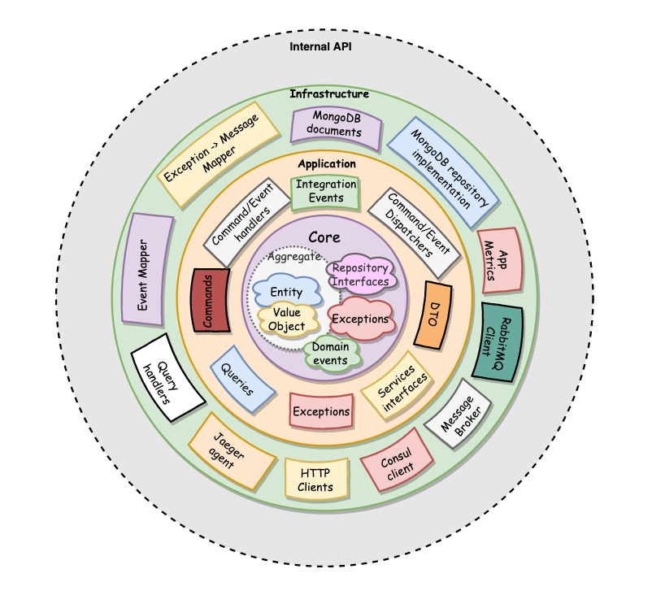

# Chatter
---------

## CQRS
Work in progress

## MessageBrokers
Work in progress

## Azure Service Bus
Work in progress

# Samples
---------

## Clean Architecture

The concept of Clean Architecture is based on the Dependency Rule which states that source code dependency can only point inwards towards the application core / domain.

The projects includes in the various services contained in these samples are:
 - API
 - Infrastructure
 - Application
 - Domain
 - Common / SharedKernel

 The dependency of the above projects flow from top to bottom (API through to Domain).

### API

Is the RESTful layer containing the controllers that faciitate HTTP/s communication.

### Infrastructure

This layer contains the infrastructure specific code for things like databases, service bus, email, file system, etc.  As this is the outer most dependency layer and references the Application (and thus Domain) layer
which typically have interfaces (adapters) describing their infrastructure needs and the implementation itself is left to the Infrastructure layer.

### Application

The application layer contains Commands / CommandHandlers, Queries and EventHandlers. This layer references the Domain layer
and contains the application specific logic. The Application layer instantiates classes from the Domain layer when business logic is required. The Application layer would typically
be responsible for interacting with Infrastructure such as email, enterprise service bus, other APIs/services via http/s (typically get requests) etc. The Application layer typically
has adapter interfaces that describe the functionality of the aforementioned infrastructure, which the Infrastruture project has the concrete implementations.

### Domain

This is where the Domain Aggregates, Entities and Value Objects live as defined by Domain-Driven Design (DDD). Encapsulated in the aforementioned objects is the business logic for
the domain in question. The Domain project will contain the interfaces it requires for repositories and because `Infrastructure --> Application --> Domain` the Infrastructure project can
implement the concrete implementation of those repositories. The Aggregates of the Domain project should be responsible for using the repository interfaces and maintaining the 
state of all Entities contained within the Aggregate. The Domain layer also has a notion of 'domain events' which occur during business logic execution in domain objects (Aggregates, Entities,
Value Objects). It will contain an nterface for a domain event handler/dispatcher that will be implemented in the Infrastructure layer (similar to respositories) and is responsible for
converting domain events into Application Events (which are then propogated depending on the Application/Infrastructure's implementation, for example, an Azure Service Bus Topic).

### Common / SharedKernel

 - Optional
 - Can be referenced by any layer. The domain layer typically references common to gain access to the common interfaces and DDD objects.
 - Can be a shared library accessed via a nuget package (For simplicity sake, a Samples.SharedKernel project has been created and is referenced by all services, however, this isn't best practice)
 - Contains common interfaces such as IRepository
 - May contain common DDD constructs such as AggregateBase, EntityBase, ValueObject
 - The shared kernel / common library should contain a interface IDomainEvent as typically the AggregateBase or EntityBase will contain a collection of domain events as domain logic is executed.
   There are some options here, two of which are:
   1) Common / SharedKernel can reference the CQRS library so that domain events can leverage the lbraries event interface. This method is used in this sample although it's typically less desirable.
   2) Common / SharedKernel can have its own IDomainEvent interface and then when these events are raised they can be converted to integration events of the application layer. The
      application layer would typically have some sort of event mapper interface which would be implemented by the infrastructure layer. In this case, the integration event is
      commonly one defined in a CQRS library. This method would lead to less dependency on other libraries, especially 3rd party libraries and is typically preferred.
