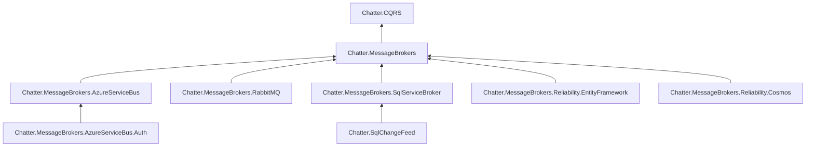
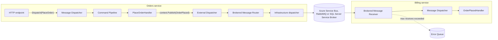
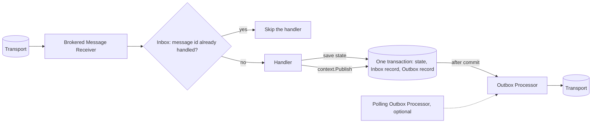

<div align="center">

# Chatter

**Modular .NET libraries for domain-driven Web APIs and microservices: an in-process CQRS core with technology-agnostic brokered messaging.**

[](https://github.com/brenpike/Chatter/actions/workflows/ci.yml)
[](https://github.com/brenpike/Chatter/actions/workflows/codeql-analysis.yml)
[](https://dotnet.microsoft.com/download/dotnet/10.0)
[](LICENSE)

</div>

Chatter lets the same Command and Event handlers serve both in-process dispatch and cross-service messaging over Azure Service Bus, RabbitMQ or SQL Server Service Broker. Durable Inbox and Outbox reliability is available on EF Core or Azure Cosmos DB. Diagnostics are opt-in, OpenTelemetry-compatible and take no OpenTelemetry package dependency.

## Contents

- [Features](#features)
- [Packages](#packages)
- [Architecture](#architecture)
- [Quick start](#quick-start)
- [Choosing packages](#choosing-packages)
- [Diagnostics](#diagnostics)
- [Domain language](#domain-language)
- [Building and testing](#building-and-testing)
- [Contributing](#contributing)
- [License](#license)

## Features

- **Message Dispatcher and Query Dispatcher**: send a Command to exactly one handler, fan an Event out to many, and route a Query to the handler that returns its Read Model.
- **Command Pipeline**: wrap every Command handler in ordered, reusable behaviors such as logging, a unit of work or an Inbox check.
- **Brokered Message Receivers**: each receiver runs as a hosted service and hands received messages to your existing handlers.
- **Three transports**: Azure Service Bus, RabbitMQ and SQL Server Service Broker behind one sending and receiving model.
- **Inbox and Outbox**: deduplicate redelivered commands and publish outgoing messages from a store, on a relational tier (EF Core) or a document tier (Azure Cosmos DB).
- **Recovery**: Retry, Circuit Breaker and an Error Queue for messages that exceed their maximum receive attempts.
- **SQL Change Feed**: strongly typed insert, update and delete notifications from a SQL Server table.
- **Opt-in diagnostics**: tracing and metrics through the .NET base class library; nothing is emitted until your application subscribes.

## Packages

| Package | NuGet | Description |
| --- | --- | --- |
| [Chatter.CQRS](src/Chatter.CQRS/src/README.md) | [](https://www.nuget.org/packages/Chatter.CQRS) | In-process CQRS for .NET: dispatch Commands, Queries and Events to their handlers, with assembly-scanned registration and a composable Command Pipeline. |
| [Chatter.MessageBrokers](src/Chatter.MessageBrokers/src/README.md) | [](https://www.nuget.org/packages/Chatter.MessageBrokers) | Technology-agnostic brokered messaging built on Chatter.CQRS: Brokered Message Receivers, sending and publishing, routing, Inbox/Outbox reliability and Recovery. |
| [Chatter.MessageBrokers.AzureServiceBus](src/Chatter.MessageBrokers.AzureServiceBus/src/README.md) | [](https://www.nuget.org/packages/Chatter.MessageBrokers.AzureServiceBus) | Azure Service Bus transport for Chatter.MessageBrokers: queue receivers, topic subscriptions, sessions and cross-entity transactions. |
| [Chatter.MessageBrokers.AzureServiceBus.Auth](src/Chatter.MessageBrokers.AzureServiceBus.Auth/src/README.md) | [](https://www.nuget.org/packages/Chatter.MessageBrokers.AzureServiceBus.Auth) | Azure AD (Microsoft Entra ID) token authentication for the Azure Service Bus transport: client secret, certificate, interactive and managed identity. |
| [Chatter.MessageBrokers.RabbitMQ](src/Chatter.MessageBrokers.RabbitMQ/src/README.md) | [](https://www.nuget.org/packages/Chatter.MessageBrokers.RabbitMQ) | RabbitMQ transport for Chatter.MessageBrokers over externally provisioned exchanges and queues, with quorum-queue delivery counting. |
| [Chatter.MessageBrokers.SqlServiceBroker](src/Chatter.MessageBrokers.SqlServiceBroker/src/README.md) | [](https://www.nuget.org/packages/Chatter.MessageBrokers.SqlServiceBroker) | SQL Server Service Broker transport for Chatter.MessageBrokers: send and receive Brokered Messages over Service Broker conversations. |
| [Chatter.MessageBrokers.Reliability.EntityFramework](src/Chatter.MessageBrokers.Reliability.EntityFramework/src/README.md) | [](https://www.nuget.org/packages/Chatter.MessageBrokers.Reliability.EntityFramework) | EF Core Inbox, Outbox and Unit of Work for Chatter.MessageBrokers, stored in your own DbContext. |
| [Chatter.MessageBrokers.Reliability.Cosmos](src/Chatter.MessageBrokers.Reliability.Cosmos/src/README.md) | [](https://www.nuget.org/packages/Chatter.MessageBrokers.Reliability.Cosmos) | Azure Cosmos DB reliability for Chatter.MessageBrokers: the Document Tier, a Standalone Inbox Gate and a change-feed Outbox Relay. |
| [Chatter.SqlChangeFeed](src/Chatter.SqlChangeFeed/src/README.md) | [](https://www.nuget.org/packages/Chatter.SqlChangeFeed) | Strongly typed insert, update and delete notifications from a watched SQL Server table, delivered over SQL Server Service Broker. |

All packages target net10.0, are versioned independently, and keep a CHANGELOG.md next to their project file.

## Architecture

### Package dependencies


```mermaid
flowchart BT
    CQRS["Chatter.CQRS"]
    MB["Chatter.MessageBrokers"]
    ASB["Chatter.MessageBrokers.AzureServiceBus"]
    AUTH["Chatter.MessageBrokers.AzureServiceBus.Auth"]
    RMQ["Chatter.MessageBrokers.RabbitMQ"]
    SSB["Chatter.MessageBrokers.SqlServiceBroker"]
    EF["Chatter.MessageBrokers.Reliability.EntityFramework"]
    COS["Chatter.MessageBrokers.Reliability.Cosmos"]
    SCF["Chatter.SqlChangeFeed"]
    MB --> CQRS
    ASB --> MB
    AUTH --> ASB
    RMQ --> MB
    SSB --> MB
    EF --> MB
    COS --> MB
    SCF --> SSB
```

An arrow points from a package to the package it depends on.

- Chatter.CQRS is the core: messages, handlers, the Message Dispatcher, the Query Dispatcher and the Command Pipeline.
- Chatter.MessageBrokers defines the broker interfaces and ships no transport.
- The transports and the reliability providers plug into Chatter.MessageBrokers, and Chatter.SqlChangeFeed builds on Chatter.MessageBrokers.SqlServiceBroker.
- Transports provision no infrastructure: you create queues, topics, exchanges and Service Broker objects yourself. Only the SqlChangeFeed Change Feed Migration creates SQL objects, and only its own.

### Brokered message flow

A handler publishes an Event through its Message Context. Chatter.CQRS hands the call to the External Dispatcher, which is a no-op until `AddMessageBrokers()` replaces it with `IBrokeredMessageDispatcher`. The Brokered Message Router passes the message to the transport's `IMessagingInfrastructureDispatcher`, and a Brokered Message Receiver in the receiving service hands it to the matching handler.


```mermaid
flowchart LR
    subgraph Orders["Orders service"]
        direction TB
        API["HTTP endpoint"] -->|"Dispatch(PlaceOrder)"| MD1["Message Dispatcher"]
        MD1 --> CP["Command Pipeline"]
        CP --> H1["PlaceOrderHandler"]
        H1 -->|"context.Publish(OrderPlaced)"| ED["External Dispatcher"]
        ED --> RT["Brokered Message Router"]
        RT --> ID["Infrastructure dispatcher"]
    end
    subgraph Billing["Billing service"]
        direction TB
        RCV["Brokered Message Receiver"] --> MD2["Message Dispatcher"]
        MD2 --> H2["OrderPlacedHandler"]
    end
    ID --> BUS[("Azure Service Bus, RabbitMQ or SQL Server Service Broker")]
    BUS --> RCV
    RCV -.->|"max receives exceeded"| EQ[("Error Queue")]
```

- Each Brokered Message Receiver runs as a hosted service, one per message type, and applies Recovery (Retry and Circuit Breaker) while it receives.
- A received Command passes through the receiving service's Command Pipeline; a received Event goes straight to its handlers.
- The `[BrokeredMessage]` attribute supplies the sending path and receiving path, so handlers need not name queues or topics.

### Inbox and Outbox flow

With the relational tier, your state change, the Inbox record and the Outbox record are saved in one database transaction, and the Outbox publishes only after that commit. A redelivered command skips its handler while its stamped Inbox record is inside the deduplication window. The [EF Core README](src/Chatter.MessageBrokers.Reliability.EntityFramework/src/README.md) covers when a handler can run again and when a message can be published twice.


```mermaid
flowchart LR
    IN[("Transport")] --> RCV["Brokered Message Receiver"]
    RCV --> INB{"Inbox: message id already handled?"}
    INB -->|"yes"| SKIP["Skip the handler"]
    INB -->|"no"| H["Handler"]
    H -->|"save state"| TX[("One transaction: state, Inbox record, Outbox record")]
    H -->|"context.Publish"| TX
    TX -->|"after commit"| OP["Outbox Processor"]
    POLL["Polling Outbox Processor, optional"] -.-> OP
    OP --> OUT[("Transport")]
```

- EF Core: `WithOutboxProcessingBehavior<TContext>()` and `WithInboxBehavior<TContext>()` add the behaviors and the Unit of Work to the Command Pipeline. `AddMessageBrokers(mb => mb.AddReliabilityOptions(r => r.WithOutboxPollingProcessor()))` adds a hosted poller that dispatches unprocessed Outbox records on an interval, retrying records whose dispatch failed, with backoff and an optional attempt ceiling.
- Azure Cosmos DB: the Document Tier writes the aggregate, a Co-Resident Outbox Document and a Batched Inbox Marker in one `TransactionalBatch`, and the change-feed Outbox Relay publishes the pending Outbox Documents.
- The Inbox and Outbox behaviors run in the Command Pipeline, so they apply to Commands.

## Quick start

### In-process CQRS

```shell
dotnet add package Chatter.CQRS
```

Define a Command and its handler:

```csharp
using Chatter.CQRS;
using Chatter.CQRS.Commands;
using Chatter.CQRS.Context;

public class PlaceOrder : ICommand
{
    public Guid OrderId { get; init; }
    public string CustomerId { get; init; }
}

public class PlaceOrderHandler : IMessageHandler<PlaceOrder>
{
    public Task Handle(PlaceOrder message, IMessageHandlerContext context)
    {
        // Change your aggregate's state here.
        return Task.CompletedTask;
    }
}
```

Register Chatter and dispatch the Command from an endpoint:

```csharp
using Chatter.CQRS;

var builder = WebApplication.CreateBuilder(args);

builder.Services.AddChatterCqrs(builder.Configuration, typeof(Program).Assembly);

var app = builder.Build();

app.MapPost("/orders", (PlaceOrder command, IMessageDispatcher dispatcher) => dispatcher.Dispatch(command));

app.Run();
```

`AddChatterCqrs` scans the assemblies you pass and registers every handler it finds. The samples use `builder.Services` and `builder.Configuration`, but any `IServiceCollection` plus `IConfiguration` works, including a `HostApplicationBuilder`.

### Messaging across services

```shell
dotnet add package Chatter.MessageBrokers.AzureServiceBus
```

Mark each message with the path it is sent to and the path it is received from. Share these types between the services that send and receive them:

```csharp
using Chatter.CQRS.Commands;
using Chatter.CQRS.Events;
using Chatter.MessageBrokers;

[BrokeredMessage(sendingPath: "orders", receivingPath: "orders")]
public class PlaceOrder : ICommand
{
    public Guid OrderId { get; init; }
    public string CustomerId { get; init; }
}

[BrokeredMessage(sendingPath: "order-events", receivingPath: "billing")]
public class OrderPlaced : IEvent
{
    public Guid OrderId { get; init; }
}
```

Register the broker and the transport in each service:

```csharp
builder.Services.AddChatterCqrs(builder.Configuration, typeof(Program).Assembly)
    .AddMessageBrokers()
    .AddAzureServiceBus(asb => asb.WithConnectionString(builder.Configuration.GetConnectionString("ServiceBus")));
```

```json
{
  "ConnectionStrings": {
    "ServiceBus": "Endpoint=sb://<namespace>.servicebus.windows.net/;SharedAccessKeyName=<key-name>;SharedAccessKey=<key>"
  }
}
```

Publish from a handler. `context.Publish` sends to the Event's sending path, here the `order-events` topic:

```csharp
using Chatter.CQRS;
using Chatter.CQRS.Context;

public class PlaceOrderHandler : IMessageHandler<PlaceOrder>
{
    public async Task Handle(PlaceOrder message, IMessageHandlerContext context)
    {
        // Change your aggregate's state here, then announce it.
        await context.Publish(new OrderPlaced { OrderId = message.OrderId });
    }
}
```

The billing service handles `OrderPlaced` with an ordinary `IMessageHandler<OrderPlaced>`, received from the `billing` subscription on the `order-events` topic. To send a Command to another service from outside a handler, inject `IBrokeredMessageDispatcher` (namespace `Chatter.MessageBrokers.Sending`) and call `Send(command)`.

> **Note:** `AddMessageBrokers()` starts a Brokered Message Receiver for every message type that has a receiving path in the scanned assemblies. The queues, topics and subscriptions must already exist.

To change transport, replace `AddAzureServiceBus(...)` with `AddRabbitMq(...)` from [Chatter.MessageBrokers.RabbitMQ](src/Chatter.MessageBrokers.RabbitMQ/src/README.md) or `AddSqlServiceBroker(...)` from [Chatter.MessageBrokers.SqlServiceBroker](src/Chatter.MessageBrokers.SqlServiceBroker/src/README.md). Each transport README explains how it maps sending and receiving paths onto its own entities.

### Durable reliability

For a relational database, install Chatter.MessageBrokers.Reliability.EntityFramework, apply its entity configurations in your `DbContext`, and add its behaviors to the Command Pipeline:

```csharp
builder.Services.AddChatterCqrs(builder.Configuration,
        pipeline => pipeline
            .WithOutboxProcessingBehavior<OrdersDbContext>()
            .WithInboxBehavior<OrdersDbContext>(),
        typeof(Program))
    .AddMessageBrokers()
    .AddAzureServiceBus(asb => asb.WithConnectionString(builder.Configuration.GetConnectionString("ServiceBus")));
```

The [EF Core README](src/Chatter.MessageBrokers.Reliability.EntityFramework/src/README.md) covers the `DbContext` mapping and migrations. For Azure Cosmos DB, register each participating Command with `WithCosmosDocumentReliability<TCommand>(...)`; see the [Cosmos README](src/Chatter.MessageBrokers.Reliability.Cosmos/src/README.md).

## Choosing packages

| Scenario | Install |
| --- | --- |
| In-process Commands, Queries and Events only | `Chatter.CQRS` |
| Commands and Events across services over Azure Service Bus | `Chatter.MessageBrokers.AzureServiceBus`, plus `Chatter.MessageBrokers.AzureServiceBus.Auth` for Azure AD or managed identity |
| Commands and Events across services over RabbitMQ | `Chatter.MessageBrokers.RabbitMQ` |
| Commands and Events across services over SQL Server Service Broker | `Chatter.MessageBrokers.SqlServiceBroker` |
| Outbox and Inbox on a relational database | `Chatter.MessageBrokers.Reliability.EntityFramework` |
| Outbox and Inbox on Azure Cosmos DB | `Chatter.MessageBrokers.Reliability.Cosmos` |
| React to row changes in a SQL Server table | `Chatter.SqlChangeFeed` |

Transports and reliability providers bring in Chatter.MessageBrokers and Chatter.CQRS automatically.

## Diagnostics

Chatter emits tracing and metrics through `System.Diagnostics.ActivitySource` and `System.Diagnostics.Metrics.Meter`. Each emitting assembly names its own scope:

| Scope | Emits |
| --- | --- |
| `Chatter.CQRS` | In-process dispatch spans and the dispatch duration metric |
| `Chatter.MessageBrokers` | Send and receive spans, messaging metrics and W3C trace context propagation |
| `Chatter.MessageBrokers.Reliability.Cosmos` | Outbox Relay drain metrics |

Subscribe with your own OpenTelemetry setup, by prefix or by naming each scope:

```csharp
builder.Services.AddOpenTelemetry()
    .WithTracing(t => t.AddSource("Chatter.*"))
    .WithMetrics(m => m.AddMeter("Chatter.*"));
```

Off means off: unless your application subscribes, nothing is emitted and no `traceparent` header is written to outgoing messages.

> **Important:** Broker-boundary attribute names follow the OpenTelemetry semantic conventions v1.30.0. They are data, not API: they may change in a minor release, and any change is announced in the affected package's CHANGELOG.

For span names, instruments and attributes, see [Chatter.CQRS diagnostics](src/Chatter.CQRS/src/README.md#diagnostics), [Chatter.MessageBrokers diagnostics](src/Chatter.MessageBrokers/src/README.md#diagnostics), [trace context propagation](src/Chatter.MessageBrokers/src/README.md#trace-context-propagation) and [Chatter.MessageBrokers.Reliability.Cosmos diagnostics](src/Chatter.MessageBrokers.Reliability.Cosmos/src/README.md#diagnostics).

## Domain language

Chatter's ubiquitous language is documented per bounded context. Start at [CONTEXT-MAP.md](CONTEXT-MAP.md); each module also has its own CONTEXT.md.

## Building and testing

Prerequisites: the .NET 10 SDK. Docker is optional; the integration tests use Testcontainers to start the Azure Service Bus emulator, RabbitMQ, the Azure Cosmos DB emulator and SQL Server.

```shell
dotnet build Chatter.sln
dotnet test
dotnet test --filter "Category!=Integration"
dotnet test --filter "Category=Integration"
```

Docker-backed tests are skipped, not failed, when Docker is unavailable.

### Real Azure Service Bus namespace tests

Cross-entity transaction tests run against a real namespace, because the emulator does not support them. They are skipped unless `CHATTER_ASB_REAL_NAMESPACE_CONNECTION_STRING` is set to a connection string with the Manage claim:

```shell
dotnet test src/Chatter.MessageBrokers.AzureServiceBus/tests/Chatter.MessageBrokers.AzureServiceBus.Tests.csproj --filter "Category=RealNamespaceIntegration"
```

In CI, the `real-namespace-integration` job in [ci.yml](.github/workflows/ci.yml) reads a repository secret of the same name and does nothing when the secret is absent.

### Releases

- Each package's version is the `<Version>` element in its csproj.
- On merge to master, `.github/workflows/<module>-cicd.yml` publishes the package to NuGet when that version has no tag yet.
- Tags are `<prefix>/vX.Y.Z`, with the prefixes `cqrs`, `messagebrokers`, `azureservicebus`, `azureservicebus-auth`, `rabbitmq`, `sqlservicebroker`, `reliability-ef`, `cosmos` and `sqlchangefeed`.

## Contributing

Issues and pull requests are welcome at [github.com/brenpike/Chatter/issues](https://github.com/brenpike/Chatter/issues). Design decisions are recorded in [docs/adr](docs/adr/).

## License

Licensed under the [MIT License](LICENSE). Copyright (c) 2020 Brennan Pike.
