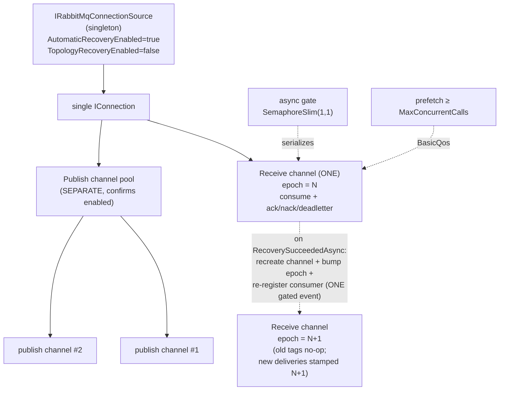
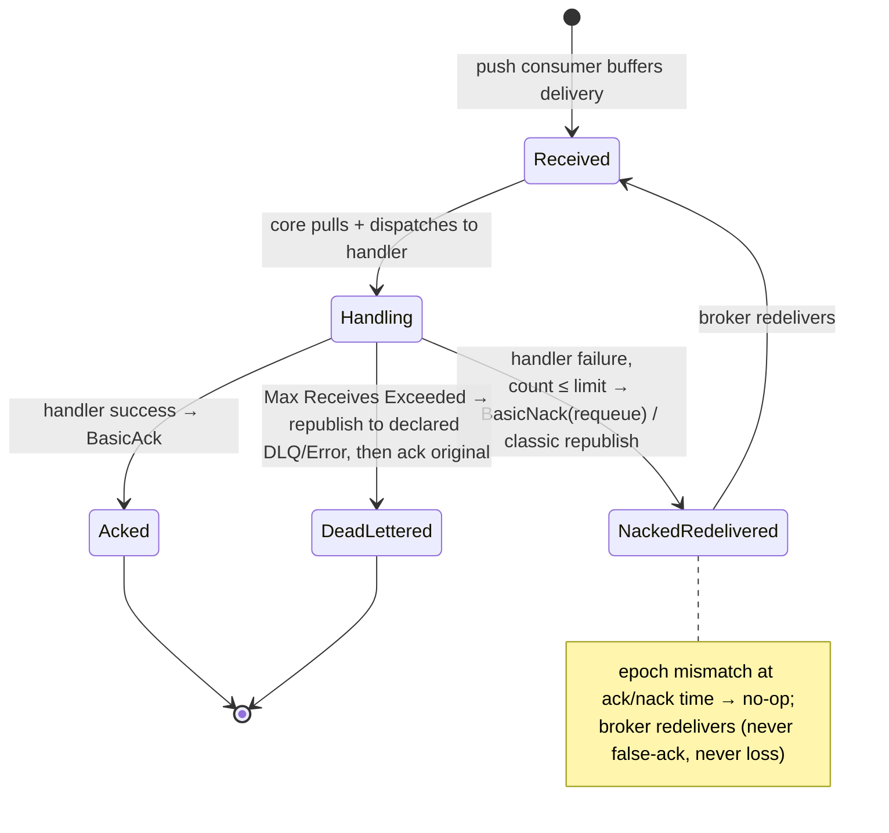
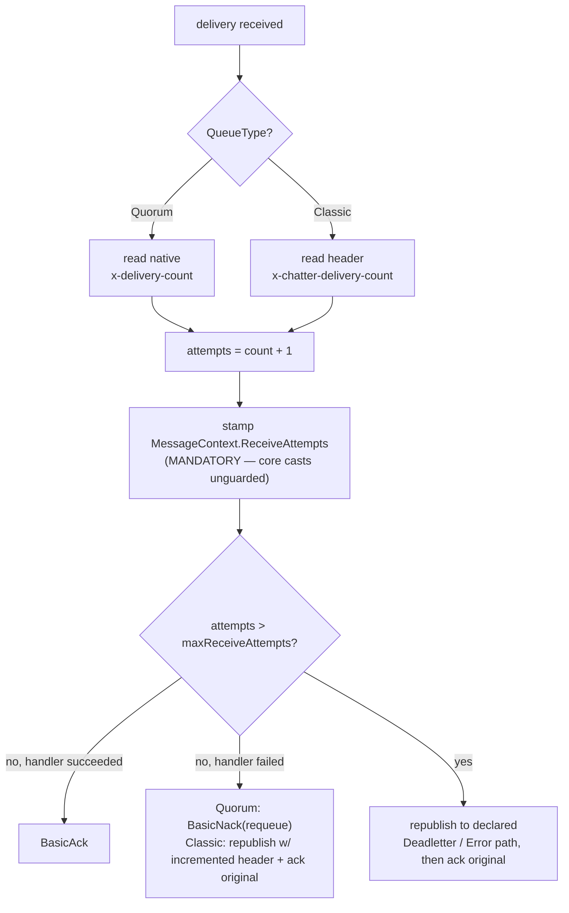
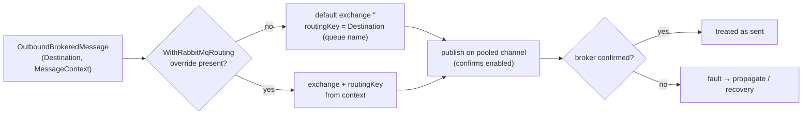

# Design: Chatter.MessageBrokers.RabbitMQ adapter

> HOW-level design of record for the `Chatter.MessageBrokers.RabbitMQ` module. Companion to
> the WHAT-only PRD (`docs/prds/rabbitmq-adapter.md`) and ADR 0001
> (`docs/adr/0001-rabbitmq-classic-queue-redelivery-counting-via-republish.md`). The 10-step
> build sequence in §11 follows this document.

## 1. Overview

`Chatter.MessageBrokers.RabbitMQ` is the eighth independently-versioned NuGet module. It is a
pure **adapter**: it implements the existing `Chatter.MessageBrokers` ports over RabbitMQ and
requires **no change to any core contract**. It is structurally analogous to the SQL Service
Broker (SSB) and Azure Service Bus (ASB) adapters — a single `AddRabbitMq(...)` registration
wires a RabbitMq Receiver and RabbitMq Sender behind the broker-agnostic interfaces, so
`[BrokeredMessage]`-decorated message types send and receive over RabbitMQ with no handler
changes.

The core contracts the adapter realizes, unchanged:

- `IMessagingInfrastructureReceiver` — the blocking pull port the core's `BrokeredMessageReceiver`
  loop drives (`ReceiveMessageAsync`, `Ack`/`Nack`/`Deadletter`, `MessageDeliveryCountAsync`,
  `CreateLocalTransaction`).
- `IMessagingInfrastructureDispatcher` — the send port (`Dispatch`).
- `IMessagingInfrastructure` — binds receiver + dispatcher + path builder under a `Type` discriminator.
- `IBrokeredMessagePathBuilder` — path resolution seam.
- `IRetryExceptionPredicatesProvider` / `ICircuitBreakerExceptionPredicatesProvider` — feed the
  shared `RetryWithCircuitBreakerStrategy` that wraps receiving.

The adapter provisions **no broker topology**: exchanges, queues, bindings, and dead-letter
routing are created and owned externally (IaC in production, Dockerfile in development),
mirroring the SSB manual-provisioning stance.

## 2. Component architecture

The adapter's pieces and the core port each one implements:

| Adapter component | Core port implemented | Notes |
| --- | --- | --- |
| `RabbitMqReceiver` | `IMessagingInfrastructureReceiver` | Push consumer feeds an internal buffer; the core drains it via the blocking pull loop. |
| `RabbitMqSender` | `IMessagingInfrastructureDispatcher` | Publishes via the default exchange (Destination = Queue name) unless an Exchange / Routing Key override is supplied. |
| `MessagingInfrastructure` (shared core type) | `IMessagingInfrastructure` | Bound under the RabbitMQ `Type` discriminator via the folded receiver/dispatcher factory, exactly as SSB does. |
| `RabbitMqPathBuilder` | `IBrokeredMessagePathBuilder` | Resolves SendingPath / ReceiverName / Error / Deadletter path names. |
| `RabbitMqBodyConverter` | `IBrokeredMessageBodyConverter` | UTF-8 JSON through shared `ChatterJson.Options`. |
| `RabbitMqRetryExceptionPredicatesProvider` | `IRetryExceptionPredicatesProvider` | Classifies transient RabbitMQ faults for retry. |
| `RabbitMqCircuitBreakerExceptionPredicatesProvider` | `ICircuitBreakerExceptionPredicatesProvider` | Classifies faults that should trip the circuit breaker. |
| `IRabbitMqConnectionSource` (adapter-owned seam) | — | Sole place a connection string becomes an `IConnection`; in-memory double substitutes it in unit tests. Analogous to SSB's `ISqlConnectionSource`. |
| `RabbitMqOptions` / `RabbitMqOptionsBuilder` | — | Connection, prefetch, queue type, body settings; `AddRabbitMqOptions()` / `AddQueueReceiver<TMessage>(...)`. |
| `AddRabbitMq(...)` DI extension | — | Single registration entry point; wires all of the above. |

The `IRabbitMqConnectionSource` seam is the testability boundary: every component that needs a
connection or channel originates it through the source, so unit tests pin receive/send/ack
behavior against an in-memory double with no live broker.

```mermaid
flowchart TB
    subgraph core["Chatter.MessageBrokers (core — UNCHANGED)"]
        BMR["BrokeredMessageReceiver<br/>(blocking pull loop)"]
        IRecv["IMessagingInfrastructureReceiver"]
        IDisp["IMessagingInfrastructureDispatcher"]
        IInfra["IMessagingInfrastructure"]
        IPath["IBrokeredMessagePathBuilder"]
        IRetry["IRetryExceptionPredicatesProvider"]
        ICb["ICircuitBreakerExceptionPredicatesProvider"]
        RWCB["RetryWithCircuitBreakerStrategy"]
    end

    subgraph adapter["Chatter.MessageBrokers.RabbitMQ (adapter)"]
        Recv["RabbitMqReceiver"]
        Send["RabbitMqSender"]
        Path["RabbitMqPathBuilder"]
        Body["RabbitMqBodyConverter"]
        RetryP["RabbitMqRetryExceptionPredicatesProvider"]
        CbP["RabbitMqCircuitBreakerExceptionPredicatesProvider"]
        Conn["IRabbitMqConnectionSource"]
        Opts["RabbitMqOptions / Builder"]
        DI["AddRabbitMq(...)"]
    end

    Broker[("RabbitMQ broker<br/>exchanges · queues · bindings · DLX<br/>(external topology)")]

    Recv -. implements .-> IRecv
    Send -. implements .-> IDisp
    Path -. implements .-> IPath
    RetryP -. implements .-> IRetry
    CbP -. implements .-> ICb
    IInfra --- Recv
    IInfra --- Send
    IInfra --- Path

    BMR --> IRecv
    BMR --> RWCB
    RWCB --> IRetry
    RWCB --> ICb

    Recv --> Conn
    Send --> Conn
    Conn --> Broker
    DI --> Opts
```



## 3. Receive pipeline

The core's `BrokeredMessageReceiver` runs a **blocking pull loop**: it calls
`ReceiveMessageAsync` repeatedly and expects each call to **block until a message is available**
(returning a non-null `MessageBrokerContext`) or to honor cancellation. It must never busy-spin.

RabbitMQ's client is **push-based** — the broker delivers to a registered consumer callback. To
bridge push to the core's pull contract, the adapter uses a **push-consumer-into-internal-buffer**
model:

- An `AsyncEventingBasicConsumer` (or equivalent async consumer) is registered on the single
  serialized receive channel during `InitializeAsync`. Its delivery callback **does not handle**
  the message; it wraps each delivery (body + headers + delivery tag + owning channel-epoch) and
  **writes it into a bounded `Channel<T>` buffer**.
- `ReceiveMessageAsync` **reads** from that `Channel<T>` with `await reader.ReadAsync(ct)`. When the
  buffer is empty the read **asynchronously parks** the loop — no CPU, no polling — until the push
  consumer enqueues the next delivery or cancellation fires. This satisfies the blocking-pull
  contract: the call blocks until a delivery is buffered, then materializes a `MessageBrokerContext`.
- The bounded buffer's capacity is tied to prefetch (see §4) so the consumer cannot run unboundedly
  ahead of the core's drain rate.

**MaxConcurrentCalls fan-out** is owned entirely by the core. The core loop acquires a concurrency
slot from its semaphore before each pull and spawns a processing worker per received message, up to
`MaxConcurrentCalls` concurrent workers. The adapter does not fan out itself — it serves one buffered
delivery per `ReceiveMessageAsync` call. Prefetch is sized `>= MaxConcurrentCalls` so the broker
keeps enough unacknowledged deliveries in flight to saturate the core's workers.

```mermaid
sequenceDiagram
    participant Broker as RabbitMQ broker
    participant Consumer as Push consumer<br/>(receive channel)
    participant Buffer as Channel&lt;T&gt; buffer
    participant Loop as Core pull loop<br/>(BrokeredMessageReceiver)
    participant Worker as Worker(s)<br/>(≤ MaxConcurrentCalls)
    participant Handler as Command/Event handler

    Broker->>Consumer: deliver (body, headers, deliveryTag)
    Consumer->>Buffer: enqueue(delivery + channel-epoch)
    Note over Buffer: bounded; capacity ~ prefetch

    loop pull cadence (serialized)
        Loop->>Loop: await semaphore slot
        Loop->>Buffer: ReceiveMessageAsync → ReadAsync(ct)
        Note over Loop,Buffer: parks (no spin) until a delivery is buffered
        Buffer-->>Loop: MessageBrokerContext
        Loop->>Worker: SpawnProcessingWorker(context)
        Worker->>Handler: dispatch by message type
        Handler-->>Worker: success / failure
        Worker->>Consumer: Ack / Nack / Deadletter (via async gate)
        Worker->>Loop: release semaphore slot
    end
```

## 4. Channel & connection topology

AMQP channels (`IModel` / `IChannel`) are **not thread-safe**, and an acknowledgement is
**channel-bound** — a delivery tag is only valid on the exact channel that delivered it. The
topology is shaped around these two constraints.

- **One singleton `IRabbitMqConnectionSource`** owns a single `IConnection` for the process. It is
  the sole originator of channels for both receive and send.
- **ONE serialized receive channel.** Consume, ack, nack, and the deadletter republish all happen on
  this single channel. Because the channel is not thread-safe and concurrent workers ack
  out-of-order, every operation on it is funneled through an **async gate** (a `SemaphoreSlim(1,1)`
  serializing access), so only one channel operation is in flight at a time.
- **SEPARATE pooled publish channels.** Sending uses its own channel(s), pooled and distinct from the
  receive channel, so publishing never contends with the receive/ack gate. Publisher confirms are
  enabled on publish channels (see §7).
- **Prefetch (`BasicQos`) `>= MaxConcurrentCalls`** on the receive channel, so the broker keeps at
  least enough unacknowledged deliveries in flight to keep all core workers busy.

### Reconnect epoch-guard (source-owned channel + consumer lifecycle)

On recovery the receive channel is **replaced**, and **delivery tags from the old channel are
meaningless on the new one** — acking an old tag on a new channel would either error or, worse,
**falsely acknowledge an unrelated delivery** that happens to share the tag value. The adapter guards
this with a **channel-epoch** stamped onto every delivery and re-checked at settle time.

The decisive design choice (ADR 0002) is **how** the epoch is kept truthful across recovery: the
source **owns the receive-channel and consumer lifecycle by construction** rather than relying on the
client's topology auto-recovery.

- The connection runs with **`AutomaticRecoveryEnabled = true`** (transport reconnects on its own) but
  **`TopologyRecoveryEnabled = false`** for the receive channel — the client does **not** silently
  re-bind the old consumer under a stale epoch.
- On **every** receive-channel (re)creation — cold start, lazy recreate, and on each
  `RecoverySucceededAsync` — the source, **under the receive gate and as one atomic event**, disposes
  any old channel, creates a fresh one, **increments the epoch**, and **re-runs the stored
  consume-registration delegate** against the new channel with the freshly-bumped epoch. The consume
  registration is the **only** code that stamps an epoch onto a delivery, and it always runs **after**
  the bump with the new epoch.
- Because the **epoch bump and the consumer re-registration are the same gated event**, a delivery's
  stamped epoch **always equals the epoch of the session that delivered it**:
  - a **pre-recovery** in-flight delivery carries the **old** epoch → its settle correctly **no-ops**,
    the broker redelivers it (never false-acked, never lost);
  - a **post-recovery** delivery is stamped by the freshly re-registered consumer with the **new**
    epoch → its settle **matches** and the message is **actually acked** (no duplicate loop).
- The bounded buffer is created **once** and is **not** recreated on re-registration, so deliveries
  buffered before recovery survive the consumer swap.

INVARIANT: a delivery's stamped epoch always equals the epoch of the session that delivered it. An
ack whose carried epoch != current channel epoch is therefore a no-op only for genuinely pre-recovery
deliveries (redelivery path); a post-recovery delivery's epoch matches and settles. This closes
**both** the recovery-stale-epoch false-ack and the topology-recovery stale-closure no-op-settle (the
post-recovery duplicate loop) **as a class, race-free** — there is no separate epoch sampling point to
race against the bump.



## 5. Acknowledgement & message lifecycle

The adapter maps the core's three terminal operations onto AMQP, all on the gated receive channel
and all epoch-guarded:

- **Ack on success** (`AckMessageAsync`) → `BasicAck(deliveryTag)`. Epoch-guarded.
- **Nack → redelivery on failure** (`NackMessageAsync`) → `BasicNack(deliveryTag, requeue: true)`
  (Quorum) — the broker increments native `x-delivery-count` and redelivers. (Classic uses the
  header-stamped republish counter; see §6.) Epoch-guarded.
- **Deadletter once Max Receives Exceeded** (`DeadletterMessageAsync`) → the adapter **republishes**
  the body to the **attribute-declared** DeadletterQueueName / ErrorQueueName (an adapter-owned
  republish, authoritative over any broker-side DLX configuration), then **acks the original**. This
  mirrors the SSB deadletter-by-republish stance.



## 6. Delivery counting

The core reads the per-message attempt count via the default `MessageDeliveryCountAsync`, which
casts `MessageContext.ReceiveAttempts` **unguarded** — so **stamping that key is mandatory**, not
optional, on every received message. Both counting strategies converge on stamping that single value
(ADR 0001).

A `QueueType` option selects the strategy (default **Quorum**, recommended):

- **Quorum strategy** — reads RabbitMQ's **native `x-delivery-count`** header, which the broker
  increments per redelivery. Adapter computes attempts = `x-delivery-count + 1` and stamps
  `ReceiveAttempts`. Redelivery on failure is a plain `BasicNack(requeue: true)`.
- **Classic strategy** — classic queues expose no native counter, so the adapter uses a
  **header-stamped republish counter**: on retry it republishes the message to its own queue with a
  custom `x-chatter-delivery-count` header incremented by 1 (publisher-confirmed), then acks the
  original. The count rides in the message, surviving reconnect, redelivery, and multi-replica
  horizontal scaling. Per ADR 0001 this carries a rare-duplicate trade-off (crash between confirmed
  republish and ack → duplicate, never loss; absorbed by the Inbox) and loss of head-of-queue
  ordering on redelivery.



## 7. Sending & addressing

- **Default-exchange convention.** With no routing override, the RabbitMq Sender publishes to the
  **default exchange (`""`)** with **Routing Key = Destination = Queue name**. Routing Key and Queue
  name coincide only under this convention.
- **Routing override.** An optional `.WithRabbitMqRouting(exchange, routingKey)` message-context
  extension carries an explicit exchange + routing key alongside the message (message-context data,
  **not** a new core contract and **not** a parsed compound destination string). When present, the
  sender publishes to that exchange with that routing key instead of the default-exchange convention.
- **Publisher confirms.** Publish channels run in confirm mode; a publish is only treated as **sent**
  once the broker confirms it. This also underpins the Classic republish counter's "confirmed before
  ack" guarantee (§6, ADR 0001).
- **BrokeredMessageAttribute fields** (`SendingPath`, `ReceiverName`, `ErrorQueueName`,
  `DeadletterQueueName`) flow from the attribute through `RabbitMqOptions` (via
  `AddQueueReceiver<TMessage>(...)`) and the `RabbitMqPathBuilder` seam, which resolves the concrete
  queue / routing names the sender and deadletter republish target.



## 8. Recovery

Recovery flows through the **same `RetryWithCircuitBreakerStrategy` seam** the ASB adapter uses; the
adapter adds nothing to the core recovery machinery.

- The RabbitMQ client runs with **`AutomaticRecoveryEnabled`** so dropped connections and channels
  reconnect on their own, but **topology (consumer) recovery is DISABLED** for the receive channel
  (ADR 0002). On each `RecoverySucceededAsync` the **source** recreates the receive channel, bumps the
  epoch, and **re-registers the consumer** under the gate as one atomic event (§4) — the source owns
  consumer lifecycle, the client does not silently re-bind it. Pre-recovery in-flight acks (old epoch)
  no-op and redeliver; post-recovery deliveries (new epoch, stamped by the re-registered consumer)
  settle normally. Publish channels keep ordinary connection recovery. ADR 0001's
  republish-before-ack ordering still holds for genuinely pre-recovery deliveries.
- `RabbitMqRetryExceptionPredicatesProvider` and `RabbitMqCircuitBreakerExceptionPredicatesProvider`
  classify **transient RabbitMQ faults** (e.g. `BrokerUnreachableException`,
  `AlreadyClosedException`, connection/channel-shutdown conditions) so the shared strategy retries
  transient receive failures and trips the circuit breaker on sustained failure — exactly as the
  other adapters' predicate providers do. Exhausting recovery yields a Critical Failure routed to the
  Error Queue (core behavior).

## 9. Transaction semantics

The adapter supports the broker-agnostic transaction modes that map cleanly onto AMQP and rejects the
one that does not:

- **None** — supported. No transactional coupling between receive and handler.
- **ReceiveOnly** — supported. Ack/nack scope the receive only.
- **FullAtomicityViaInfrastructure** — **rejected at startup** with a clear message directing the user
  to the **Outbox** (the supported reliability path for transactional send). RabbitMQ offers no atomic
  receive-and-send across the consume and a downstream publish; rather than silently degrade, the
  adapter fails fast at registration.
- `CreateLocalTransaction(...)` **returns `null`** (the core default), since there is no infrastructure
  local transaction to enlist.

## 10. Topology ownership

The module **provisions nothing**. The receiver assumes the exchanges, queues, bindings, and
dead-letter routing already exist (IaC in production, Dockerfile in development), mirroring the SSB
manual-provisioning stance.

Required topology shape:

- A **work queue** per receiver, named to match the configured Destination / ReceiverName (the
  default-exchange convention publishes by routing key = queue name).
- A **dead-letter / error queue** matching the attribute-declared `DeadletterQueueName` /
  `ErrorQueueName` — the adapter republishes to these **by name** (authoritative), independent of any
  broker-side DLX configured on the work queue.
- **Bindings** as required for any non-default-exchange routing the application uses via
  `.WithRabbitMqRouting(...)`.

**Quorum queues are the documented recommendation** (native `x-delivery-count`, no rare-duplicate or
ordering trade-off). Classic queues are supported for users who cannot adopt quorum and who accept the
ADR 0001 trade-offs.

## 11. Build sequence (10 steps)

The single-PR, ten-step HOW sequence the build directive follows:

1. **STEP-001** — `Chatter.MessageBrokers.RabbitMQ.csproj` (net8.0;net10.0, version 0.1.0, RabbitMQ.Client dep) + solution wiring + test project skeleton.
2. **STEP-002** — message-context keys + `RabbitMqOptions`/`RabbitMqOptionsBuilder` + `RabbitMqBodyConverter` (UTF-8 JSON via `ChatterJson.Options`).
3. **STEP-003** — `IRabbitMqConnectionSource` seam + production implementation (singleton `IConnection`, receive-channel epoch, async gate, pooled publish channels, `AutomaticRecoveryEnabled`).
4. **STEP-004** — `RabbitMqReceiver` (push-consumer → `Channel<T>` buffer, blocking pull, ack/nack/deadletter, epoch-guard, delivery counting) + retry & circuit-breaker predicate providers.
5. **STEP-005** — `RabbitMqSender` (default-exchange convention, confirms, deadletter republish) + `.WithRabbitMqRouting(...)` context extension.
6. **STEP-006** — `AddRabbitMq(...)` DI extension + `InfrastructureTypes.RabbitMq()` extension + `RabbitMqPathBuilder` + `IMessagingInfrastructure` registration.
7. **STEP-007** — unit tests against the in-memory `IRabbitMqConnectionSource` double (options, DI, infra-type resolution, receive, ack/nack, body round-trip, transient-fault classification).
8. **STEP-008** — Testcontainers integration tests (round-trip, nack redelivery, deadletter; Max Receives proven on both quorum and classic), docker-gated, excluded from PR CI.
9. **STEP-009** — module docs / README (registration, required external topology, quorum recommendation) + CHANGELOG.
10. **STEP-010** — per-module CI workflow + nightly integration wiring.
